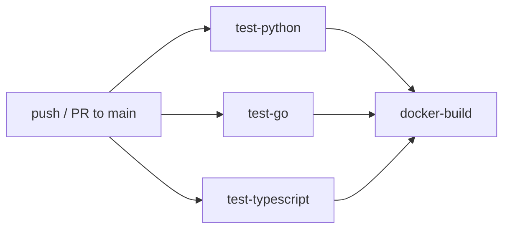

# Architecture

Trilingual Gateway のシステム全体像・データフロー・設計判断をまとめたドキュメントです。
API のリクエスト仕様は [`README.md`](../README.md) を参照してください。本ドキュメントは
「なぜこの構成になっているのか」「サービスをまたいで一貫させている規約は何か」を扱います。

## 1. 概要 (What & Why)

Trilingual Gateway は 3 つの独立したサービスを 1 リポジトリで並走させる **polyglot
microservices の学習・実験用ベースライン**です。同じドメインに近い機能を 3 つの
言語 (Python / Go / TypeScript) で実装することで、以下のような比較・学習を狙って
います。

- 同一のリクエスト観測性 (アクセスログ / レスポンスヘッダ) を 3 スタックで揃えると
  どう書き分けるか
- 集計 API (`by_day` / `by_week` / `by_month` / `by_hour_of_day` / `by_day_of_week`)
  を 3 スタックで揃えるとどう共通化 / 分岐するか
- graceful shutdown・入力バリデーション・ページネーションといった "地味に大事な"
  横断ポリシーを polyglot でどう統一するか

このため、外部ミドルウェア (DB / メッセージブローカー / OAuth プロバイダ等) を持ち
込まず、**プロセス内メモリで完結する** ことを意図的な設計方針にしています。永続化や
サービス間通信は Non-Goals (§6) を参照してください。

## 2. サービス構成

```mermaid
graph LR
    Client[Client / API Consumer]

    subgraph "docker compose network"
        PY["analytics-py<br/>Python 3.12 / Flask<br/>:8001"]
        GO["processor-go<br/>Go 1.22 / net/http<br/>:8002"]
        TS["usermgmt-ts<br/>TypeScript / Express<br/>:8003"]
    end

    Client -- "/api/events*" --> PY
    Client -- "/api/messages*, /api/stats" --> GO
    Client -- "/api/users*" --> TS

    PY -. healthcheck .-> HC1[/health]
    GO -. healthcheck .-> HC2[/health]
    TS -. healthcheck .-> HC3[/health]
```

3 サービスは **相互に通信しません**。クライアント (curl / Postman / SPA 等) から
それぞれの API を直接叩く構成で、`docker compose` はネットワーク・healthcheck・
ライフサイクル管理のみを担います。共有ドメイン (ユーザーがイベントを発火する等) を
表現したい場合は、クライアント側で複数サービスに逐次リクエストを送る想定です。

| サービス | 言語 / フレームワーク | ポート | 主責務 |
|---|---|---|---|
| `analytics-py` | Python 3.12 / Flask | 8001 | イベント記録と集計 (`/api/events*`) |
| `processor-go` | Go 1.22 / `net/http` | 8002 | メッセージ受信と channel 別集計 (`/api/messages*`, `/api/stats`) |
| `usermgmt-ts` | TypeScript / Express | 8003 | ユーザー CRUD と登録推移集計 (`/api/users*`) |

## 3. 各サービスの内部構造

### 3.1 analytics-py (Python 3.12 / Flask)

- **ストレージ**: モジュール変数 `events_store: list[dict]` + `threading.Lock`。
  Flask の開発サーバは複数リクエストを並行処理し得るため、追記・削除・スナップショット
  取得のクリティカルセクションは必ずロックで保護している。
- **退避 (eviction)**: `MAX_EVENTS` (既定 `10000`) を超えたら **古い側から** 削除。
  メモリ使用量を上限で頭打ちにするための FIFO 退避で、Prometheus のような時間窓ベース
  ではない (低依存を優先している)。
- **リクエスト観測性**: `before_request` / `after_request` フックで `method / path /
  status / duration` を 1 行に集約 INFO ログ出力し、同値を `X-Response-Time-Ms`
  ヘッダにも返す。`time.perf_counter_ns()` を使い、システムタイムジャンプに影響
  されない単調増加な計測にしている。
- **入力バリデーション**: JSON 本文サイズ (`MAX_PAYLOAD_SIZE`)、`event_name` の型・
  空文字・長さ (`MAX_EVENT_NAME_LENGTH`)、`properties` の型 (dict 必須) を、集計系
  クエリでは `since` / `until` の ISO 8601 パースと `since <= until` の順序性を、
  それぞれ 400 で拒否する。
- **テスト**: `pytest`。`test_app.py` が API 全体、`test_middleware.py` がアクセス
  ログとレスポンスヘッダを検証する。

### 3.2 processor-go (Go 1.22 / net/http)

- **ストレージ**: プロセス内のメッセージリストを `sync.RWMutex` で保護。書き込みは
  排他ロック、読み取り (list / stats / by_*) は共有ロックで並行性を上げる。
- **依存**: **標準ライブラリのみ**。外部ルーティングライブラリ (gin / chi 等) を
  持ち込まず、`http.ServeMux` と手書きの method dispatch で構成する。`go.sum` が
  存在しないため CI では `cache-dependency-path: services/processor-go/go.mod` を
  指定してキャッシュキーを取っている。
- **サーバチューニング**: `http.Server` に `ReadHeaderTimeout` / `ReadTimeout` /
  `WriteTimeout` / `IdleTimeout` を明示 (Slowloris 対策 / TCP 資源保護)。
  `SHUTDOWN_TIMEOUT_SECONDS` を境に `Shutdown()` で in-flight を待ってから終了する
  graceful shutdown を実装する。
- **リクエスト観測性**: analytics-py と同じ意味論のアクセスログと `X-Response-Time-Ms`
  ヘッダを、`http.Handler` を wrap したミドルウェアとして実装する。
- **テスト**: `go test -race ./...`。`main_test.go` が API、`middleware_test.go` が
  横断ミドルウェア、`main_by_period_test.go` が時系列集計 (`by_day` / `by_week` /
  `by_month` / `by_hour_of_day` / `by_day_of_week`) を検証する。

### 3.3 usermgmt-ts (TypeScript / Express)

- **ストレージ**: in-memory `Map<string, User>`。Node.js はシングルスレッドイベント
  ループのためロックは不要 (I/O 待ちで yield しない同期処理のみ)。
- **email の正規化**: 保存時に `email` を **小文字に正規化** し、大文字違いを含めた
  重複を拒否する。UNIQUE 制約を持つ RDB を持ち込まないため、アプリ層で厳密に扱う。
- **ドメイン集計**: `/api/users/by_domain` は email の `@` 以降を小文字化して集計。
  B2B SaaS のワークスペース単位トラッキングやテストドメイン混入検知を想定。
- **リクエスト観測性**: 他 2 サービスと同じ意味論のアクセスログと `X-Response-Time-Ms`
  ヘッダを、Express の middleware として実装する。
- **テスト**: `jest`。`app.test.ts` が API 全体、`by_*.test.ts` が時系列集計を検証する。
  `tsc --noEmit` を CI に含めて型検査を行う (実行は `ts-node` / トランスパイル)。

## 4. 横断的な設計ポリシー

3 サービス間で意図的に揃えている規約です。片方だけ変える場合は、他 2 サービスにも
波及させるかどうかを PR で明示してください。

### 4.1 リクエスト観測性

| 項目 | 実装 |
|---|---|
| アクセスログ | `method path -> status (duration_ms)` の 1 行 INFO ログ |
| 応答ヘッダ | `X-Response-Time-Ms: <ms>` (小数 3 桁) |
| 計測 | 単調増加時計 (`perf_counter_ns` / `time.Now`) を使い、システムタイムジャンプの影響を受けない |

BFF / SPA 側から `X-Response-Time-Ms` を拾って UI に載せる、あるいは Datadog 等の
APM に集約するのを見越した構造化です。

### 4.2 集計エンドポイントの命名・挙動規約

`by_day` / `by_week` / `by_month` / `by_hour_of_day` / `by_day_of_week` を、原則
3 サービス共通の以下の規約で提供します。

- **タイムゾーン**: 常に UTC で正規化してからバケット化 (`by_hour_of_day` / `by_week` の
  境界で TZ 越境ズレを起こさない)。
- **キー形式**:
  - 日次 `YYYY-MM-DD` / 週次 `YYYY-Www` (ISO 8601 週年) / 月次 `YYYY-MM`
  - 時刻 `"00"`〜`"23"` (2 桁ゼロ詰め) / 曜日 `"1"`=Mon〜`"7"`=Sun (ISO)
  - すべて **lex 順 = カレンダー順** になるようゼロ詰めしている
- **populated-only**: 母集団 0 のバケットは省略。連続する空日を返さないため、
  ダッシュボード側で "軸生成 → join" するとゼロ埋めもできる。
- **フィルタ**: `event_name` / `channel` / `role` / `q` / `since` / `until` を、対応
  する list エンドポイントと **同じセマンティクス** で受け付ける (`q` は大文字小文字
  無視の部分一致)。

### 4.3 ページネーション・ソート・フィルタの共通クエリ規約

list 系エンドポイントは以下の共通クエリを持ちます (詳細な既定値は `README.md` を
参照)。

- `limit` / `offset`: 負値は既定値、`MAX_*_LIMIT` を超えたら上限にクランプ (400 は
  返さず暗黙補正)
- `sort` / `order`: サービスごとに許可フィールドを ALLOWLIST 化し、未許可は 400
- `q`: 大文字小文字無視の部分一致 (対象フィールドはサービスごとに定義)
- `since` / `until`: ISO 8601 / RFC 3339。`since > until` は 400

### 4.4 環境変数命名規約

- `<SERVICE>_PORT` (`ANALYTICS_PORT` / `PROCESSOR_PORT` / `USERMGMT_PORT`)
- `MAX_*` (件数・長さの上限)、`DEFAULT_*` (既定値)
- `*_TIMEOUT` / `*_TIMEOUT_SECONDS` / `*_TIMEOUT_MS` (タイムアウト)

新しい環境変数を追加した際は必ず [`.env.example`](../.env.example) にコメントアウト
形式で追記し、既定値と意味を README の "Environment Variables" 表にも反映してください。

## 5. ローカル開発とデプロイフロー

### 5.1 `make` ターゲット

`Makefile` は self-documenting で、`make` (引数なし) でターゲット一覧が出ます。

| ターゲット | 用途 |
|---|---|
| `make test` | 3 サービスすべてのテスト (`test-python` / `test-go` / `test-ts`) |
| `make lint` | 3 サービスすべての lint (flake8 / `go vet` / eslint) |
| `make up` / `make down` | `docker compose` の起動 / 停止 |
| `make ps` / `make logs` | 状態確認 / ログ tail |
| `make clean` | Python キャッシュ / Node.js `node_modules` / `dist` / `coverage` を削除 |

### 5.2 `docker-compose`

3 サービスすべてが `/health` に対する healthcheck を持ち、`interval: 10s`,
`retries: 3`, `start_period: 5s` で ready 判定します。`docker compose ps` で
`healthy` / `unhealthy` が確認できます。

### 5.3 CI パイプライン (`.github/workflows/ci.yml`)



- **並列**: `test-python` / `test-go` / `test-typescript` は独立に走る (どれか
  1 つの失敗でも他は最後まで走る)
- **依存**: `docker-build` は 3 テストジョブが全 green のときのみ走る (壊れたコード
  でイメージを焼くのを防ぐ)
- **concurrency**: `${{ github.workflow }}-${{ github.ref }}` でグループ化し、
  同一ブランチに連続 push した際は古いジョブをキャンセルして実行枠を節約する
- **キャッシュ**: pip (`requirements*.txt`) / Go modules (`go.mod`) / npm
  (`package-lock.json`) をそれぞれのセットアップアクションでハッシュキーにする

## 6. 意図的な非採用事項 (Non-Goals)

以下は現時点で **意図的に採用しない** ものです。将来必要になった際に追加できる
フックのみ言及します。

| 項目 | 現状 | 理由 / 将来のフック |
|---|---|---|
| 永続化 DB | in-memory のみ | 学習用ベースラインの依存を最小化。導入時はサービスごとに Repository パターンで抽象化する余地がある |
| 認証 / 認可 | なし | ドメインロジックの実装比較にフォーカスするため。導入時は Express middleware / Flask before_request / Go middleware で 3 スタック共通の JWT / API Key 検証を追加する |
| サービス間 RPC | 相互通信なし | Non-goal (§2 参照)。導入時はクライアント側 orchestration → gRPC / HTTP+OpenAPI の順で検討 |
| メッセージブローカー | channel は Go プロセス内のみ | 外部 broker (Kafka / NATS) を持ち込まない。導入時は `processor-go` の書き込みパスに publish フックを追加する |
| 分散トレーシング | ログ + `X-Response-Time-Ms` のみ | OpenTelemetry SDK は各言語で導入可能だが、依存の追加を避けている |
| 水平スケール | in-memory 前提で不可 | 永続化 or 共有ストア (Redis 等) の採用が前提条件 |

## 7. 参照ドキュメント

- [`README.md`](../README.md) — API リファレンス、環境変数、Quick Start
- [`CONTRIBUTING.md`](../CONTRIBUTING.md) — ブランチ / コミット / PR の運用
- [`CODE_OF_CONDUCT.md`](../CODE_OF_CONDUCT.md) — 行動規範
- [`SECURITY.md`](../SECURITY.md) — 脆弱性報告手順
- [`CHANGELOG.md`](../CHANGELOG.md) — バージョンごとの変更履歴
- [`.github/SUPPORT.md`](../.github/SUPPORT.md) — サポート窓口
